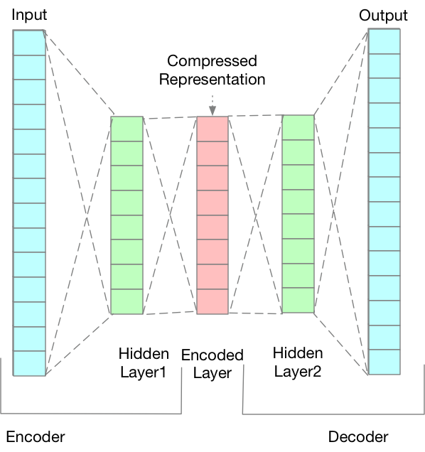

# Neural Network Based project to interpolate missing data.

**This project does not use any Machine learning based library to build the predicting model**

This project is mainly capable of predicting/interpolating respondent's unanswered question from a [survey](https://osf.io/pqf9r/)   .

My model utlize **kmeans clustering and countvectorizer** to transfer natural language into vector, apply **one-hot-encoding** to convert dataset into training dataset. I**mplemented both neural network with one hidden layer, and Autoencoder with two hidden layers model to predict/interpolates answer.** Developed the directed graph about mutual dependenies between different feature based on the result of using neural network to analyze the dataset. Use sentiment analysis based on logistic regression model to analyze the result of natural language answers. 

**Tricky Part - Limited Size of Dataset**
The size of survey dataset is relatively small, only 4000 responds answered the survey, and most of them did not answer every question in the survey.

**Solution:**

Create lots of training data by knocking out various subsets of features for a certain respondent, so that I enlarge the size of training dataset, also it is a way to prevent over-fitting.

 
 
 

Generated Dependency Graph for Feature 
 

# Full report can be found [here](https://drive.google.com/file/d/14_vzbLP0NoF3b48bx8hFbInaVb4DKJ16/view?usp=sharing)

 ## Usage

Use Jupyter Notebook to run ./FINAL.ipynb

## License

MIT License. See [`LICENSE.md`](LICENSE.md).

## Contact

haodong.zheng@rutgers.edu

